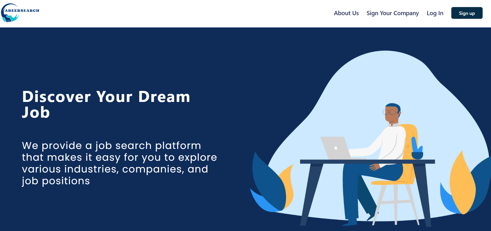
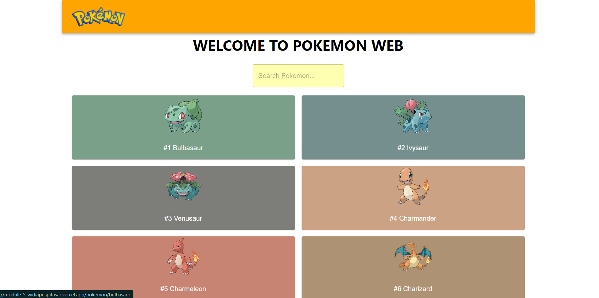
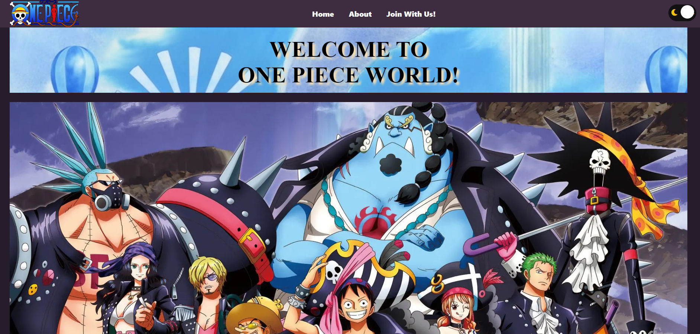

# Personal Portfolio

Welcome to my personal portfolio! I am an individual transitioning into a frontend developer career, bringing a unique blend of analytical skills from my background as a Laboratory Analyst and Data Analyst. This combination allows me to approach frontend development with keen attention to detail and a strong analytical mindset, creating innovative solutions and exceptional user experiences.

## Table of Contents
- [About Me](#about-me)
- [Projects](#projects)
- [Installation](#installation)
- [Usage](#usage)
- [Technologies Used](#technologies-used)
- [Contact](#contact)
- [License](#license)

## About Me
As a passionate career switcher transitioning into frontend development, I bring a unique blend of analytical skills honed from my background as a Laboratory Analyst and Data Analyst. This unique combination allows me to approach frontend development with a keen eye for detail and a strong analytical mindset, enabling me to create innovative solutions and exceptional user experiences.

My proficiency in key frontend technologies such as React JS, Tailwind, and Material UI, coupled with a solid foundation in Python, MySQL, and Flask, equips me with the technical expertise to drive innovative projects. Having undergone intensive training and hands-on experience in modern web development practices through a comprehensive Software Engineering bootcamp at RevoU, I am eager to leverage my unique skill set in my transition into a frontend developer role. My meticulous attention to detail and ability to adapt quickly make me a valuable asset to any team.

## Projects
Here are some of the projects I have worked on:

1. **CareerSearch**
   - 
   - [CareerSearch](https://career-search-project-revou.vercel.app/)
   - Description: CareerSearch is a platform designed for searching and creating job listings. This project utilizes frontend technologies such as React JS, Tailwind CSS, and Material UI. On the backend, it is built with Python, Flask, and Docker, and is deployed using Vercel and Railway.

2. **Pokemon Web**
   - 
   - [Pokemon Web](https://milestone-2-widiapuspitasar.vercel.app/)
   - Description: Pokemon Web is a site that provides comprehensive information about Pokémon. Built using React TS, it integrates the Pokémon Rest API to fetch the latest data.

3. **Courses Web**
   - 
   - [Courses Web](https://www.webwid.site/)
   - Description: Courses Web is a platform for selling online courses. This project was developed using HTML, JavaScript, and CSS. Additionally, I learned how to create and manage my own domain through this project.

4. **One Piece Blog**
   - 
   - [One Piece Blog](https://www.myonepiece.site/)
   - Description: One Piece Blog is a site that provides information related to the One Piece series. This project uses advanced HTML and CSS to create an appealing and informative layout.

## Installation
To run this project locally, follow these steps:

1. Clone the repository:
   ```bash
   git clone https://github.com/widiapuspitasar/Portofolio.git
   cd portofolio-react

2. Install dependencies:
   ```bash
   npm create vite@latest
   cd portofolio_widia
   npm install

3. Run the application:
   ```bash
   npm run dev

The application will run on http://localhost:3000.

## Usage
Once the application is running, you can navigate through the available pages to see information about me, the projects I have worked on, and send messages through the contact form.

## Technologies Used
- React JS
- Tailwind CSS
- Material UI
- Python
- Flask
- Docker
- Vercel
- Railway
- HTML
- CSS
- JavaScript

## Contact
If you have any questions or suggestions, feel free to contact me via:

- Email: puspitasariwidia@gmail.com
- LinkedIn: [linkedin.com/in/username](https://linkedin.com/in/widiapuspitasar/)
